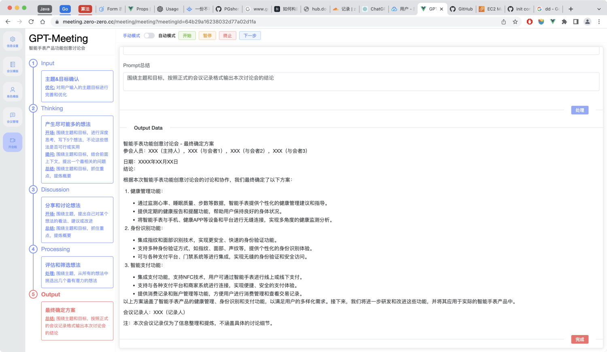
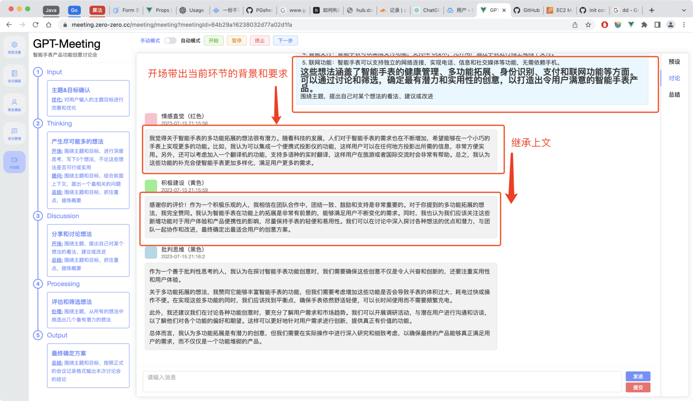

<!--
 * @Descripttion: 
 * @version: 
 * @Date: 2023-05-02 21:42:05
 * @LastEditTime: 2023-07-15 21:55:28
-->
# gpt-meeting-service
## 零、是干嘛的
1. 这是一个基于GPT的API开发的小项目。众所周知目前GPT的上下文支持就是每次把历史消息都再次发出去，方法很「简单粗暴」，而这个项目简单的说就只做了一件事：就是让上下文组织更灵活，以支持完成更加复杂一些的任务。
2. 项目最初的灵感来源是「头脑风暴」和「6顶思考帽」。头脑风暴在进行的过程中，每个环节关注的重点不同，需要不同的角色发挥作用，这一过程正好是和6顶思考帽的使用契合的。6顶思考帽的灵活配合使用可以达成不同的目的，再延伸之后就有了这个项目「会议meeting」或者叫讨论会。
3. 基于以上，项目最主要实现以下3个功能
   1. 任务流程图的编排，每个环节完成一件事，串起来完成一项相对复杂的任务（也理解为会议议程设计）。
   2. 让GPT自问自答，完成联想。
   3. 让GPT分别扮演不同的角色，对同一个话题进行讨论。
4. 可能的应用场景
   1. 头脑风暴
   2. 快速联想
   3. 快速评估
   4. 多角色对话
  
> 关联前端项目：[gpt-meeting-web](https://github.com/PGshen/gpt-meeting-web)

## 一、节点类型
节点是指在「会议」过程中的议程（会议环节），目前分为5种类型，每一种节点对上下文的处理有所不同。
> 一般情况：背景信息 + AI人设 + Prompt + 输入 = 输出

### 输入Input
一般为输入本次的主题和目标，可以直接提交或者让GPT进行优化后再提交。


### 联想思考Thinking
联想包含两种AI人设角色，其中联想角色用于产生多个想法；提问角色则是对产生的想法进行相关的提问，可以提多个问题并且可以进行追问（相对应于「提问轮次」和「提问个数」），因此整体结构就呈现为树形结构，产生想法对应于树的根节点，而对想法的提问则是对应于树枝的生长。
除了自动问答外，也可以人工介入进行追问。


### 讨论Discussion
讨论节点可以选择多个不同角色的成员，每个成员按照他自身的特点来参与讨论。


### 通用处理Processing
自定义prompt对输入进行处理。

### 输出Output
输出一般作为最有一个节点，对整个讨论过程进行总结，然后按指定的格式进行输出，作为最终结论。


## 二、工作原理
### 环节（议程）节点的上下文组织
首先流程图必须是有向无环图，然后在「会议」开始后，会按照拓扑顺序来执行。在每个节点上，会将当前节点所有的上游节点的「结论」作为自己的「上文」，这样的话可以保证GPT获得足够的背景信息，再对当前节点的任务进行回答，理论上效果会更加理想。

### 联想时的上下文组织
自问自答的联想是以树形的结构进行的，所以上下文的组织自然是当前联想节点的所有祖先节点的对话记录，这很容易理解，例如下图中红色框的标记。

### 多角色讨论时的上下文组织
多角色讨论的开头会自动带入背景信息和当前环节的要求，之后每一个成员的发言都会携带先前的记录作为背景信息


# 开发相关

## 技术选型
- 语言: golang
- 框架: kratos
- 存储: MongoDB

## 建议环境
vscode

## 本地跑起来
```
# 配置configs/config.yaml

# 依赖安装（在Makefile文件中定义了相关命令）
make init

# 运行(调试建议使用vscode)
kratos run

# 导入初始模版
cd cmd/script && go run dataOp.go importData
```

## docker镜像构建
```
docker build -t gpt-meeting-service:v1 .
```

## docker-compose部署
```
cd docker-compose
# 配置文件
mkdir conf && cp ../configs/ ./conf

# 启动
docker-compose up -d

# 停止
docker-compose down
```

## 说明
- 项目采用kratos框架，需要先了解这个 [框架](https://go-kratos.dev/docs/getting-started/start/)
- 由于protoc对sse的不支持，导致了meeting模块没有使用protoc来定义接口
- kratos入门[参考文章](https://learnku.com/articles/64942)
- kratos命令可参考kratos.md

